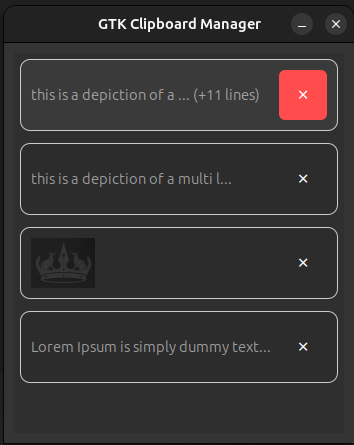

# PasteQ

A lightweight and responsive clipboard manager for Linux, built using Python and GTK. Supports both text and image history, persistent sessions, and quick paste via `xdotool`.

---

## 🖼️ Screenshot




## 🚀 Features

- 📄 Tracks clipboard history (text + images)
- 🖼️ Inline image previews
- 🔢 Limit history to 50 entries (configurable)
- ✂️ Remove items manually
- 📌 Always on top, hidden from Alt+Tab and Taskba
- 🧠 Remembers recent clipboard entries without duplicates

---

## 🛠 Requirements

### ✅ Python
- Python 3.7 or newer

### 📦 Python Dependencies

Install via pip:

```bash
pip install PyGObject
```
## 🧱 System Dependencies (Ubuntu/Debian)

Make sure these packages are installed on your system:

```bash
sudo apt update
sudo apt install -y \
  python3-gi \
  python3-gi-cairo \
  gir1.2-gtk-3.0 \
  gir1.2-gdkpixbuf-2.0 \
  xdotool
```

## 🔧 Setting a Custom Keyboard Shortcut

To launch the clipboard manager using a keyboard shortcut:

1. Open **Settings** → **Keyboard**
2. Scroll down and click **View and Customize Shortcuts**
3. At the bottom, select **Custom Shortcuts**
4. Click the **➕ Add Custom Shortcut** button
5. Fill in the details:

   - **Name**:  
     _Your choice (e.g., Clipboard Manager)_

   - **Command**:  
     ```bash
     python3 /path/to/main.py
     ```
     > Replace `/path/to/main.py` with the full path to the `main.py` script you downloaded.

   - **Shortcut**:  
     _Set a key combo like `Ctrl+Alt+V`_

6. Click **Add** and you're done!

You can now open the clipboard manager window anytime using your chosen shortcut
